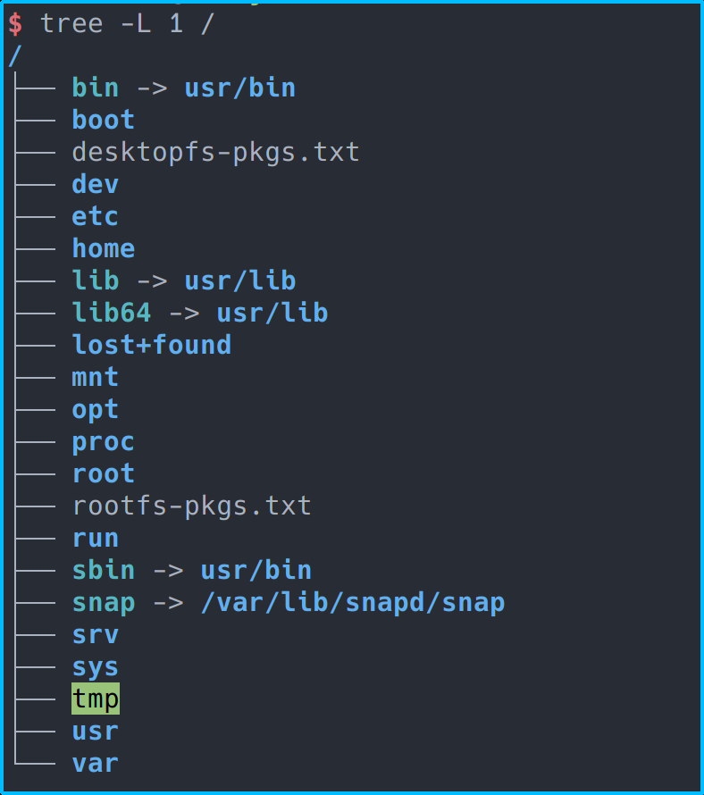
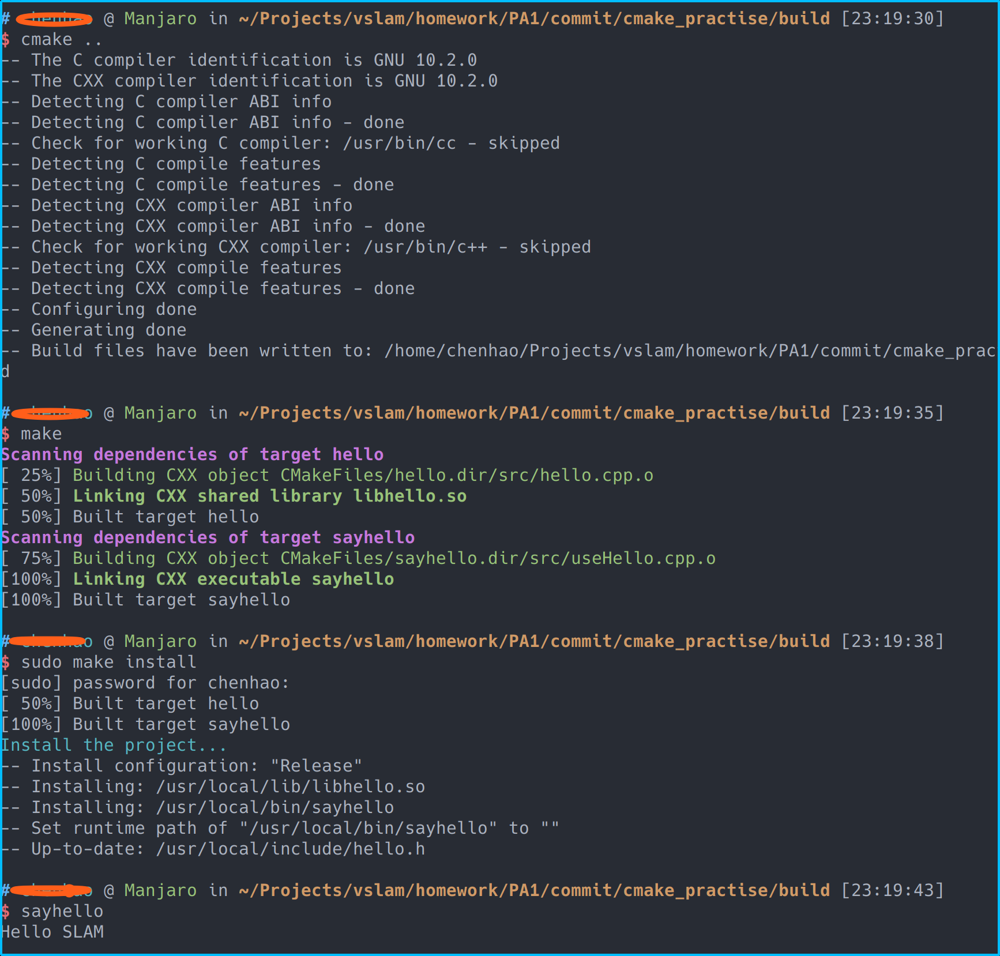
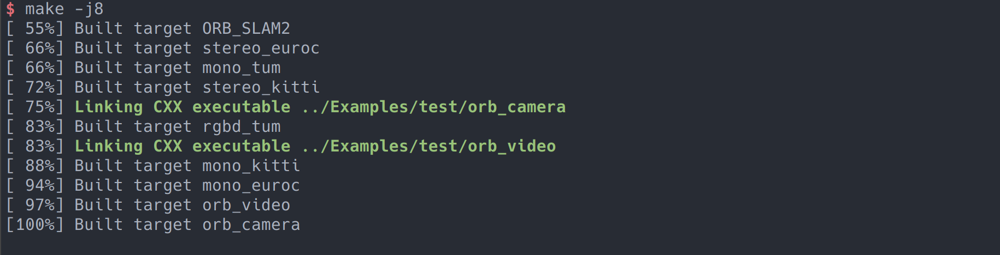
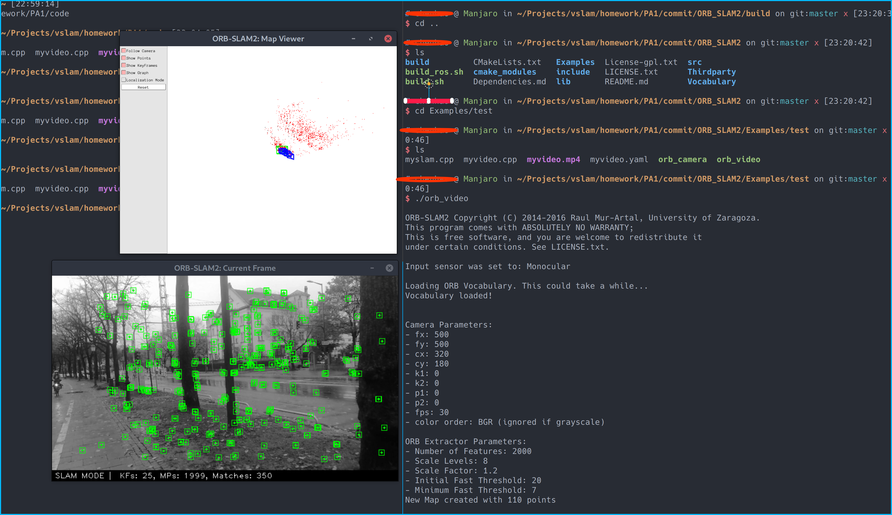

# 第一章作业

## 2. 熟悉Linux

### 2.1 如何在 Ubuntu 中安装软件(命令行界面)?它们通常被安装在什么地方?

Ubuntu中用`sudo apt install xxx`来安装软件，一般安装在`/usr`目录下，比如可执行文件在`/usr/bin`目录，库文件安装在`/usr/lib`目录下等。

### 2.2 linux 的环境变量是什么?我如何定义新的环境变量?

Linux打开一个shell会加载一些用于定义环境属性的变量比如PATH等，这些环境变量可以被引用来获取相关环境配置。

临时设置环境变量可以在终端中运行`export AA=xxx`。

如果想要永久生效，用户环境变量可以写在.bashrc或者.zshrc这样的配置文件中。 系统环境变量可以写在`/etc/profile`中。

### 2.3 linux 根目录下面的目录结构是什么样的?至少说出 3 个目录的用途。

linux根目录下有如下目录：



其中，boot目录存放一些与启动相关的文件以及镜像，dev目录是外设目录，linux中外设都是文件的形式， etc目录主要用来存放系统的配置文件;

home目录是用户目录，每个用户都在home目录下有一个自己的目录，mnt用于临时挂载一些文件系统，usr目录存放用户的应用程序及其相关文件。

### 2.4 假设我要给 a.sh 加上可执行权限,该输入什么命令?

chmod +x a.sh

### 2.5 假设我要将 a.sh 文件的所有者改成 xiang:xiang,该输入什么命令?

chown xiang:xiang a.sh

## 3. SLAM 综述文献阅读

### 3.1 SLAM 会在哪些场合中用到?至少列举三个方向。

手持设备定位， 自动驾驶， AR

### 3.2 SLAM 中定位与建图是什么关系?为什么在定位的同时需要建图?

定位与建图是感知的两个方面，定位侧重于自身状态的估计，建图则是对环境进行建模。已建立的地图可以辅助定位，还可以用来导航。

### 3.3 SLAM 发展历史如何?我们可以将它划分成哪几个阶段?

classical age： 主要是发现了一些基于概率的方法，这个阶段的方案主要以滤波为主

algorithmic-analysis age： 主要研究算法的基本性质包括客观性,收敛性和稳定性，这个阶段也认识到了SLAM问题的稀疏性并可以高效求解。

### 3.4 列举三篇在 SLAM 领域的经典文献

《Improved Techniques for Grid Mappingwith Rao-Blackwellized Particle Filters》

《real-time loop closure in 2D LIDAR SLAM》

《ORB-SLAM: a Versatile and Accurate Monocular SLAM System》

## 4. CMake 练习

代码见cmake_pratise目录，运行截图如下：



## 5. 理解 ORB-SLAM2 框架

### 5.1 下载代码


### 5.2 代码结构

#### 5.2.1 编译结果

一个动态库，libORB_SLAM2 , 还有以下的可执行文件rgbd_tum, stereo_kitti, stereo_euroc, mono_tum, mono_kitti, mono_euroc

#### 5.2.2 include,src,Example下有什么


#### 5.2.3 链接了哪些库

`${OpenCV_LIBS}, ${EIGEN3_LIBS}, ${Pangolin_LIBRARIES}, libDBow2.so, libg2o.so`

## 6. ORB_Slam2

#### 6.1 编译截图


#### 6.2 添加代码，修改CMakeLists

增加两个可执行文件，链接到libORB_SLAM2.so。修改内容如下：

```cmake
set(CMAKE_RUNTIME_OUTPUT_DIRECTORY ${PROJECT_SOURCE_DIR}/Examples/test)

add_executable(orb_camera
Examples/test/myslam.cpp)
target_link_libraries(orb_camera ${PROJECT_NAME})

add_executable(orb_video
Examples/test/myvideo.cpp)
target_link_libraries(orb_video ${PROJECT_NAME})
```

编译结果如图：



#### 6.3 运行截图



