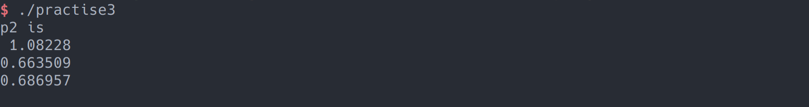
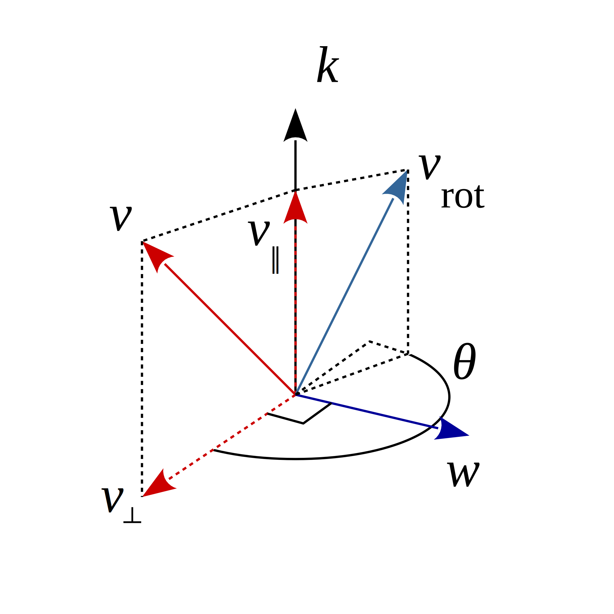
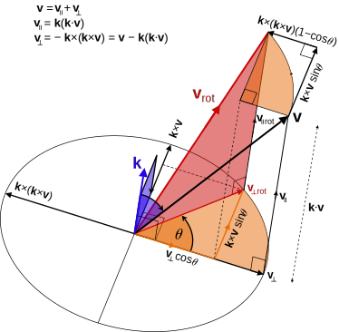

# 第二章作业

## 1. 熟悉Eigen矩阵运算

设线性方程组 $ Ax = b $，$A$为方阵，设其阶数为$n$，增广矩阵为$B = (A|b)$

### 1.1 什么条件下，$x$有唯一解

$rank(A) = rank(B) = n$, 即A和B的秩相等且为n

### 1.2 高斯消元法的原理是什么?

高斯消元法首先对增广矩阵进行初等行变换，把B变成一个三角矩阵，然后从后往前依次带入得到最终解。

### 1.3 QR分解的原理是什么？

$QR$分解是把矩阵$A$分解为$A=QR$的形式, 其中$Q$是正交矩阵，$R$是上三角矩阵

### 1.4 Cholesky 分解的原理是什么?

如果$A$是一个实对称正定矩阵，则$A$可分解为一个下三角矩阵及其转置的乘积，即$A = LL^T$.

### 1.5 编程实现 A 为 100 × 100 随机矩阵时,用 QR 和 Cholesky 分解求 x 的程序

代码如下：

```c++
#include <iostream>
#include <Eigen/Dense>

int main()
{
    Eigen::Matrix<double, 100, 100> A = Eigen::MatrixXd::Random(100, 100);
    A = A * A.transpose();

    Eigen::Matrix<double, 100, 1> x;
    Eigen::Matrix<double, 100, 1> b = Eigen::MatrixXd::Random(100, 1);

    // QR
    x = A.colPivHouseholderQr().solve(b);
    std::cout << "QR" << std::endl;
    std::cout << x << std::endl;

    // Cholesky
    x = A.ldlt().solve(b);
    std::cout << std::endl << "Cholesky" << std::endl;
    std::cout << x << std::endl;

    return 0;
}
```

> 运行结果太长了，就不截图了。

## 2. 几何运算练习

设有小萝卜一号和小萝卜二号位于世界坐标系中。

小萝卜一号的位姿为: $q_1 = [0.55, 0.3, 0.2, 0.2], t_1 =
[0.7, 1.1, 0.2]^T$ (q 的第一项为实部)。这里的 q 和 t 表达的是 $T_{cw}$,也就是世界到相机的变换关系。

小萝卜二号的位姿为 $q_2 = [−0.1, 0.3, −0.7, 0.2], t_2 = [−0.1, 0.4, 0.8]^T$。

现在,小萝卜一号看到某个点在自身的坐标系下,坐标为 p 1 = [0.5, −0.1, 0.2] T ,求该向量在小萝卜二号坐标系下的坐标。

**代码如下：**

```c++
#include <iostream>
#include <Eigen/Core>
#include <Eigen/Dense>

int main()
{
    Eigen::Quaterniond q1(0.55, 0.3, 0.2, 0.2);
    Eigen::Quaterniond q2(-0.1, 0.3, -0.7, 0.2);
    q1.normalize();
    q2.normalize();

    Eigen::Vector3d t1(0.7, 1.1, 0.2);
    Eigen::Vector3d t2(-0.1, 0.4, 0.8);

    Eigen::Vector3d p1(0.5, -0.1, 0.2);

    Eigen::Isometry3d T_1w(q1);
    T_1w.pretranslate(t1);
    Eigen::Isometry3d T_2w(q2);
    T_2w.pretranslate(t2);

    // p2 = T_2w * T_w1 * p1
    Eigen::Vector3d p2 = T_2w * T_1w.inverse() * p1;
    std::cout << "p2 is " << std::endl << p2 << std::endl;

    return 0;
}
```

**运行结果如下：**



## 3. 旋转的表达

### 3.1 设有旋转矩阵 $R$,证明 $R^TR = I$ 且$det R = +1$ 

由于旋转矩阵都是正交矩阵，因此$R^T = R^{-1}$，故$R^TR = R^{-1}R = I$。

设$R$把正交基$I$转为$I^{'}$，即$I^{'} = RI$, 由于$detI = detI^{'} = 1$, 故$detR = 1$

### 3.2 设有四元数 q,我们把虚部记为 ε,实部记为 η,那么 q = (ε, η)。请说明 ε 和 η 的维度

$\epsilon$为3维，$\eta$为标量。

### 3.3 证明

定义$q^{+}$和$q^{\oplus}$为
$$
q^{+} =  \left[
\matrix{
  \eta1+ \epsilon^{\times} & \epsilon\\
  -\epsilon^{T} & \eta\\
}
\right], 
q^{\oplus} =  \left[
\matrix{
  \eta1- \epsilon^{\times} & \epsilon\\
  -\epsilon^{T} & \eta\\
}
\right]
$$
其中运算$\times$和$\wedge$相同，即取$\epsilon$的反对称矩阵(它们都成叉积的矩阵运算形式), $1$为单位矩阵。请证明对任意单位四元数 $q_1, q_2$ ,四元数乘法可写成矩阵乘法:
$$
q_1q_2 = q_1^{+}q_2
$$
或者
$$
q_1q_2 = q_2^{\oplus}q_1
$$
证明如下：

$$
q_1^+q_2 =\left[
\matrix{
  \eta_11+ \epsilon_1^{\times} & \epsilon_1\\
  -\epsilon_1^{T} & \eta_1\\
}
\right]
\left[
\matrix{
 \epsilon_2\\
 \eta_2\\
}
\right]=
\left[
\matrix{
  \eta_1\epsilon_2+ \eta_2\epsilon_1 +\epsilon_1^\wedge \epsilon_2\\
  -\epsilon_1^T\epsilon_2 +\eta_1\eta_2
}
\right]
=q_1q_2
$$
同理可证：
$$
q_2^{\oplus}q_1 = q_1q_2
$$


## 4. 罗德里格斯公式证明

罗德里格斯公式定义为:
$$
R = cos{\theta}I + (1 - cos{\theta})nn^T + sin{\theta}n^{\wedge}
$$
证明如下：

> 参考 [Rodrigues' rotation formula](https://en.wikipedia.org/wiki/Rodrigues%27_rotation_formula)



如上图, 向量$\boldsymbol{v}$绕单位向量$\boldsymbol{k}$旋转$\theta$，得到向量$\boldsymbol{v_{rot}}$, $\boldsymbol{v}$可分解为垂直和平行与旋转轴的分量$v_{\perp},v_{\parallel}$。则有：
$$
\boldsymbol{v} = v_{\perp} + v_{\parallel} \\
v_{\parallel} = (k \cdot v)k \\
v_{\perp} = v-v_{\parallel} = v-(k \cdot v)k
$$


如上图，有：
$$
v_{\perp} = -k \times (k \times v) \\
v_{{\parallel}rot} = v_{\parallel} \\
\|v_{{\perp}rot}\| =\| v_{\perp}\|
$$
 由上图，根据三角关系，有：
$$
v_{{\perp}rot} = cos\theta v_{\perp} + sin\theta k \times v_{\perp}
$$
因为$k$与$v_{parallel}$平行，所以它们做叉乘结果为$\boldsymbol{0}$向量，且根据$v$与投影分量的关系，有:
$$
k \times v_{\perp} = k \times (v-v_{\parallel}) = k \times v - k \times v_{\parallel} = k \times v
$$
所以
$$
v_{{\perp}rot} = cos\theta v_{\perp} + sin{\theta}(k \times v)
$$
故：
$$
\begin{aligned}
& v_{rot}  = v_{{\parallel}rot} + v_{{\perp}rot} \\
&\ \ \ \ \ \ =v_{\parallel} + cosθ v_{\perp}+sinθ(k \times v) \\
&\ \ \ \ \ \ = v_{\parallel} + cosθ(v−v_{\parallel})+sinθ(k×v) \\
&\ \ \ \ \ \ =cosθv+(1−cosθ)v_{\parallel} + sinθ(k×v) \\
&\ \ \ \ \ \  =cosθv+(1−cosθ)(k⋅v)k+sinθ(k×v)
\end{aligned}
$$
即：
$$
v_{rot} = cosθv + sinθ(k×v) + (1−cosθ)(k⋅v)k
$$
由于：
$$
k^{\wedge} = K = \left[
\matrix{
  0 & -k_z & k_y \\
  k_z & 0 & -k_z \\
  -k_y & k_x & 0
}
\right],
$$
所以有：
$$
Kv=k×v \\
K^2v=k×(k×v)
$$
结合公式(5)(6)，有：
$$
\begin{aligned}
& v_{rot}=cosθv+(1−cosθ)v_{\parallel}+sinθ(k×v)\\
& \ \ \ \ \ \ \ =cosθv+(1−cosθ)(v+k×(k×v))+sinθ(k×v)
\end{aligned}
$$
整理得：
$$
\begin{aligned}
& v_{rot}=v+K^2v−cosθK^2v+sinθKv \\
& \ \ \ \ \ \ =v(I+K^w−cosθK^2+sinθK)
\end{aligned}
$$
由于：
$$
v_{rot} = R * v
$$
则：
$$
R=I+(1−cosθ)K^2+sinθK
$$
根据公式(12)有：
$$
K^2=kk^T−I
$$
整理可得：
$$
R=cosθI+(1−cosθ)kk^T+sinθk^×
$$
证毕。

## 5. 四元数运算性质的验证

假设一个点$p = [0, x, y, z]^T$, 经过旋转$q = [cos\frac{\theta}{2}, \hat{n}sin\frac{\theta}{2}]$后得到$q^{'}$.

则：
$$
q^{'} = qpq^{-1} = [cos\frac{\theta}{2}, n_xsin\frac{\theta}{2}, n_y\frac{\theta}{2}, n_z\frac{\theta}{2}] [0, x, y, z]\frac{q^{*}}{\|q\|^{2}} \\
=[cos\frac{\theta}{2}, -n_xsin\frac{\theta}{2}, -n_y\frac{\theta}{2}, -n_z\frac{\theta}{2}] [0, x, y, z][cos\frac{\theta}{2}, n_xsin\frac{\theta}{2}, n_y\frac{\theta}{2}, n_z\frac{\theta}{2}]
$$
取运算结果实部为：
$$
(-xn_xsin\frac{\theta}{2}-yn_ysin\frac{\theta}{2}-zn_zsin\frac{\theta}{2})(cos\frac{\theta}{2}) \\
-(xcos\frac{\theta}{2}+zn_ysin\frac{\theta}{2}-zn_ysin\frac{\theta}{2})(-n_xsin\frac{\theta}{2}) \\
-(ycos\frac{\theta}{2}-zn_xsin\frac{\theta}{2}+xn_zsin\frac{\theta}{2})(-nysin\frac{\theta}{2}) \\
-(zcos\frac{\theta}{2}+yn_xsin\frac{\theta}{2}-xn_ysin\frac{\theta}{2})(-n_zsin\frac{\theta}{2}) \\
$$
上式整理后为0.

## 6. 熟悉C++11

```c++
#include <iostream>
#include <vector>
#include <algorithm>
using namespace std;

class A {
public:
	A(const int& i ) : index(i) {}
	int index = 0;
};

int main() {
    A a1(3), a2(5), a3(9);
    vector<A> avec{a1, a2, a3};
    std::sort(avec.begin(), avec.end(), [](const A&a1, const A&a2) {return a1.index<a2.index;});
    for ( auto& a: avec ) cout<<a.index<<" ";
    cout<<endl;
    return 0;
}
```

第15行用到了lambda表达式，`std::sort`函数中传入一个自定义比较函数。

第16行用到范围for循环，其中还用到auto自动类型推倒。